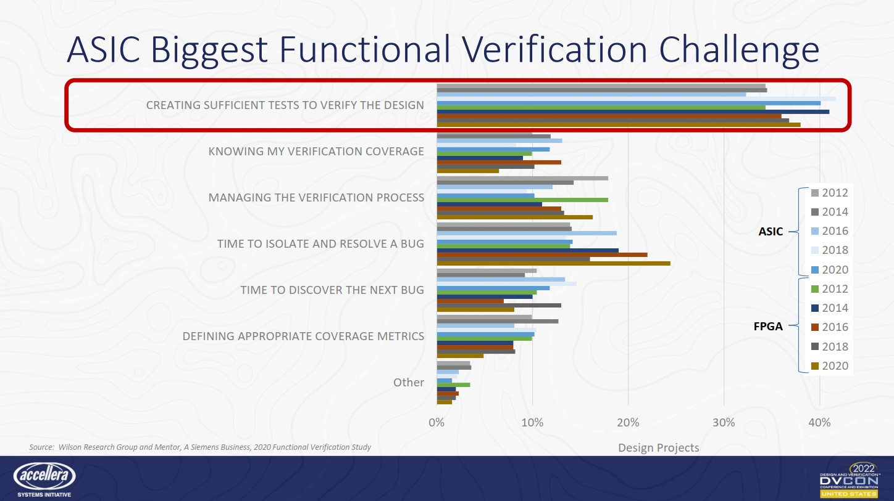
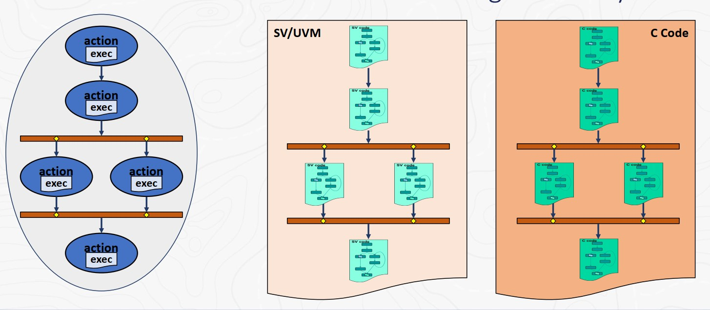
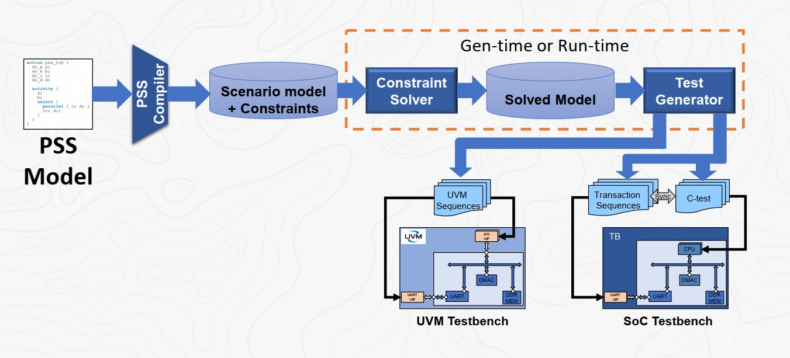
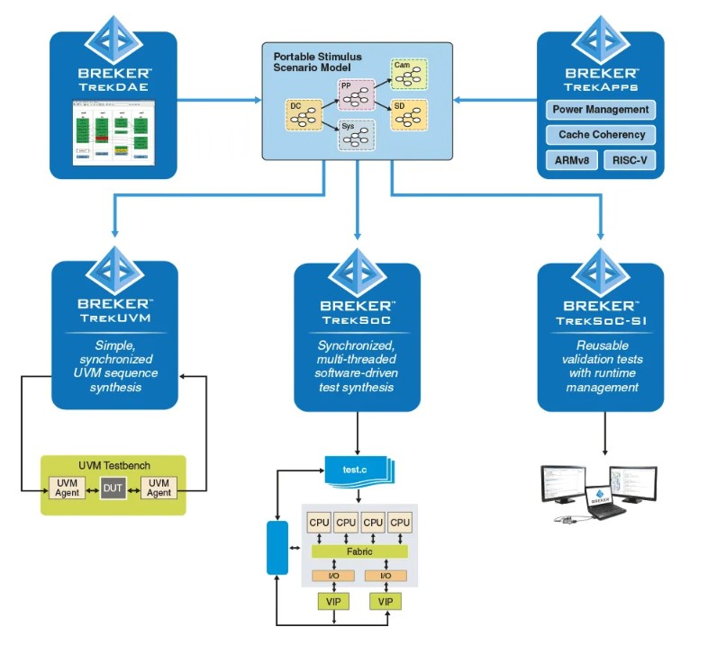
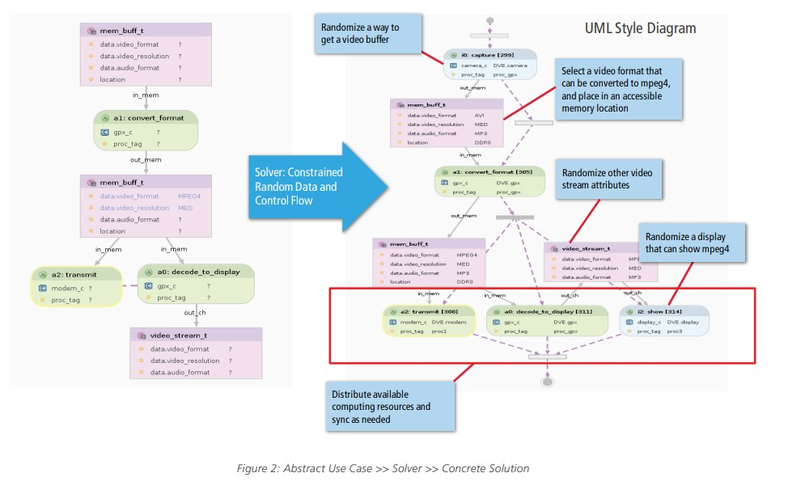

# Автоматизация создания тестовых сценариев в маршруте функциональной верификации

Подготовил: Страхов Александр Сергеевич, инженер отдела верификации АО НПЦ "Элвис"  

---

### Введение

За последние 20 лет идея проектирования систем на кристалле (СнК) стала доминирующей в текущем развитии вычислительной техники. Такие системы обладают рядом преимуществ, таких как компактность, сниженное энергопотребление и т.д.  
В современном маршруте проектирования особое место занимает процесс функциональной верификации (ФВ) СнК, цель которой заключается в проверке соответствия описания аппаратуры до этапа изготовления кристалла. На данный процесс приходится около 70% общего времени разработки.

### Планируемые цель и задачи по диссертационному исследованию

**Цель — интегрировать метод автоматизации по созданию тестовых сценариев в существующий маршрут верификации АО НПЦ "Элвис".**  

Задачи по исследованию:  

1. Анализ стандарта PSS и инструментов по генерации тестовых сценариев;  
2. Проведение экспериментов по интеграции маршрута генерации тестовых сценариев в уже существующий маршрут верификации АО НПЦ "Элвис", взаимодействие инструмента *Cadence Perspec* с инструментами компании;  
3. Составление методической литературы с рекомендациями по написанию моделей PSS. 

### Актуальность  

Несмотря на непрерывное усовершенствование инструментов и методов ФВ, ряд процессов остаются слабо автоматизированным. Одним из таких сложных процессов является написание тестовых сценариев и самих тестов, который занимает примерно 40% от всего времени ФВ. Слишком долгий процесс верификации задерживает выпуск проекта на стадию производства, из-за чего своевременный выход на рынок новых продуктов может оказаться под угрозой.  

Основными причинами такой слабой автоматизированности являются:

1. Многообразие тестируемых IP-блоков и способов их интеграции. Несмотря на функциональное единообразие двух используемых IP-блоков, их внутренняя реализация, регистровая спецификация и параметры могут оказаться разными, из-за чего подходы к проверке этих блоков могут различаться;  
2. "Кодовый барьер" при написании одних и тех же верификационных сценариев на разных уровнях (уровень IP-блока, уровень подсистемы/СнК). Например, при разработке тестов уровня IP-блока в традиционном маршруте используют язык SystemVerilog, в то время как для тестов уровня подсистемы/СнК должен использоваться язык, компилируемый для тестируемого процессорного ядра (например, C);  
3. Невозможность повторого использования некоторых тестовых сценариев в будущих проектах. Ряд интеграционных тестов, обеспечивающих проверку взаимодействия нескольких IP-блоков между собой, зачастую написаны вручную для удовлетворения необходимого тестового сценария. Также, эти тесты исключают рандомизацию входных тестовых стимулов в целях достижения лучшего процента покрытия.  

### Пути по автоматизации процесса функциональной верификации  

#### Стандартизация инструментов разработки и верификации

1. UVM (Universal Verification Methodology) — Стандартизованная методология проверки цифровых схем, состоящая из библиотеки классов, которая вносит значительную автоматизацию в язык описания аппаратуры SystemVerilog;  
2. IP-XACT — формат описания регистрового поля, портов ввода/вывода IP-блока, написанных на языке разметки XML.
3. VIP — верификационные IP-блоки периферийных протоколов, разработанные сторонними компаниями (такими как Synopsis, Cadence, Siemens (Mentor Graphics) и т.д) на базе методологии UVM.  

#### Инструменты и методы, разработанные в НПЦ ЭЛВИС  

1. SoC DUT Template — Шаблонное верификационное окружение, предназначенное для верификации проектов подсистем/СнК с процессорным ядром MIPS32. Обладает всеми необходимыми компонентами верификации, такими как универсальными чекерами системных шин семейства AMBA, возможность быстрого подключения компонентов VIP и т.д.
2. Кроссплатфроменная библиотека Libcpptest — набор программных методов обращения к памяти/регистрам проектируемого СнК, драйверов IP-блоков, предназначенная для создания тестовых сценариев на языке программирования C++. 

### Стандарт PSS (Portable Stimulus Standard)  

В течение многих лет недостижимой мечтой инженеров-верификаторов была **концепция исполняемой спецификации**, написанной простым и понятным языком. Цель данной концепции заключается в гибком управлении всем процессом функциональной верификации с помощью случайно генерируемых тестовых сценариев, ограниченных самой спецификацией. Такое множество сценариев позволит увеличить функциональное покрытие верифицируемого проекта, сделав его более интуитивным и предсказуемым. Кроме того, использование подобной концепции должно позволить сделать переносимыми сами сценарии тестирования из одного проекта в другой, и из одного уровня в другой.  
Реализация данной концепции появилась в новом стандарте PSS, разработанном компанией Accellera Systems Initiative. Данный стандарт определяет предметно-ориентированный язык (DSL), на котором описывается модели поведения IP-блоков и правила их взаимодействия внутри СнК или подсистемы (иерархия транзакций).

Стандарт определяет использование языка в маршруте функциональной верификации на более ранних этапах, а также путь от самой PSS-модели до готовых тестов на языках SystemVerilog или C.

#### Существующие решения по реализации PSS в маршруте верификации

Первым коммерческим решением по созданию данной концепции, стал набор инструментов от компании **Breker**. Программы *TrekSoC* и *TrekUVM* обеспечивают упрощение по созданию необходимой верификационной инфраструктуры, а также визуализацию зависимостей составленных PSS-моделей с помощью UML-графов.

Аналогичный инструмент имеется и от компании Cadence под названием *Perspec System Verifier*. Данный инструмент интегрирован в семейство инструментов для разработки и верификации *Verisium* и позволяет использовать все преимущества от использования полного пакета ПО от Cadence.  

